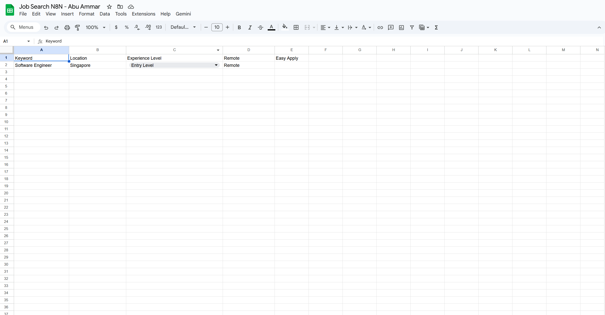
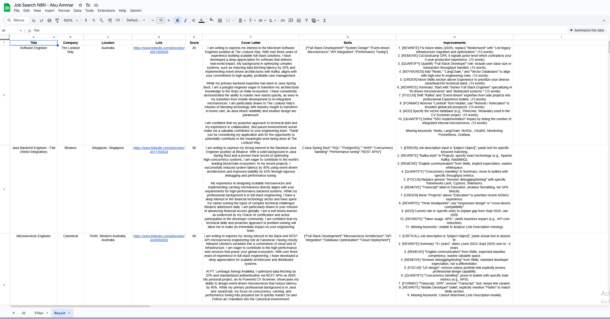

# Automated Job Matching & Cover Letter Generator (n8n)

Automates LinkedIn job search, AI-powered resume matching, and cover letter generation using Google Gemini.

## Features

- **LinkedIn Scraping** – Fetches jobs based on filters from Google Sheets
- **AI Scoring** – Gemini Flash scores job fit (0-100)
- **Cover Letter** – Auto-generates tailored 150-200 word drafts
- **Resume Tips** – Gemini Pro suggests improvements per job
- **Deduplication** – Skips already-processed jobs
- **Email Alerts** – Sends results summary to your inbox

## Google Sheets Setup

### Input Sheet
| Keyword | Location | Experience Level | Remote | Easy Apply |
|---------|----------|------------------|--------|------------|
| Software Engineer | Singapore | Entry Level | Remote | ✓ |

### Result Sheet
| Title | Company | Location | Link | Score | Cover Letter | Skills | Improvements |
|-------|---------|----------|------|-------|--------------|--------|--------------|

## Credentials Required

- **Google Drive API** – Resume access
- **Google Sheets API** – Read/write sheets
- **Google Gemini API** – AI analysis
- **Gmail API** – Email notifications

## Quick Start

1. Import `job-match-Automation-n8n.json` into n8n
2. Configure credentials above
3. Upload resume (PDF) to Google Drive, update file ID in workflow
4. Set up Input & Result sheets as shown
5. Run manually or schedule daily
