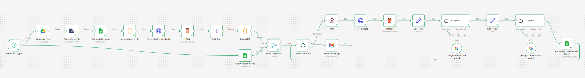

# Automated Job Matching & Cover Letter Generator (n8n)

This n8n workflow automates the process of finding relevant jobs on LinkedIn, analyzing your fit against your resume using Google Gemini, and generating tailored cover letters.

## Features

*   **Automated Scraping**: Fetches job listings from LinkedIn based on keywords and location filters defined in a Google Sheet.
*   **Resume Analysis**: Extracts text from your Resume (PDF) stored in Google Drive.
*   **AI-Powered Scoring**: Uses **Google Gemini 3 Flash** to score the job fit (0-100) based on skills, experience, and responsibilities.
*   **Draft Generation**: Automatically generates a tailored 150-200 word cover letter for high-match roles.
*   **Resume Improvement**: Uses **Google Gemini 3 Pro** to suggest specific resume edits to increase your success rate for each job.
*   **Notifications**: Logs all results to Google Sheets and sends an email alert with the match score and actionable insights.

## Workflow Steps

1.  **Trigger**: Scheduled daily (e.g., 5:00 AM) or triggered manually.
2.  **Input Data**:
    *   Downloads your Resume from Google Drive.
    *   Reads search criteria (Keywords, Location, Remote prefernce, etc.) from a Google Sheet.
3.  **Job Search**: Constructs a LinkedIn search URL and scrapes job postings.
4.  **Processing (Loop)**:
    *   Fetches full job descriptions.
    *   **Gemini Agent 1**: Analyzes the JD vs. Resume, calculates a Match Score, and writes a Cover Letter.
    *   **Gemini Agent 2**: Generates a ruthless list of resume improvements (keywords to add, bullets to rewrite).
5.  **Output**:
    *   Appends the Job Title, Company, Match Score, Cover Letter, and Suggestions to a Google Sheet.
    *   Sends an HTML-formatted email summary to your inbox.

## Setup Requirements

### Credentials
You need to set up the following credentials in n8n:
*   **Google Drive API**: To access your resume.
*   **Google Sheets API**: To read search filters and write results.
*   **Google Gemini (PaLM) API**: For the AI agents.
*   **Gmail API**: To send email alerts.

### Configuration
1.  **Google Sheet**: Create a sheet with columns for your search filters (Keyword, Location, Experience Level, Remote, etc.).
2.  **Resume**: Upload your resume (PDF) to Google Drive and update the file ID in the "Download file" node.
3.  **Output Sheet**: Create a destination sheet with columns: `Title`, `Company`, `Location`, `Link`, `Score`, `Cover Letter`, `Skills`, `Improvements`.

## Usage
Import the `job-match-Automation-n8n.json` file into your n8n instance and configure the credentials.
